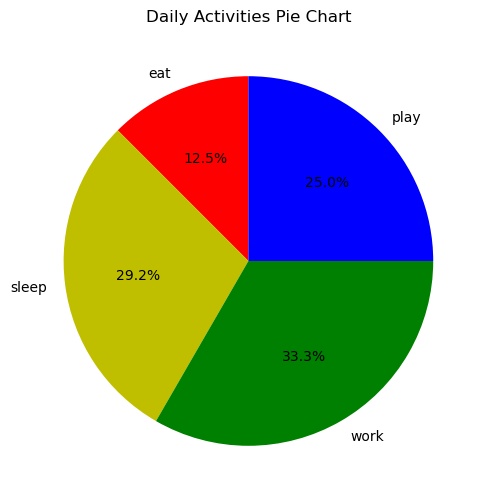
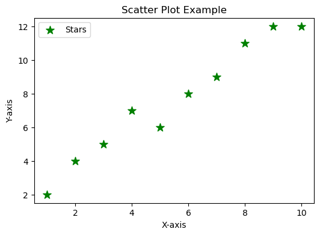
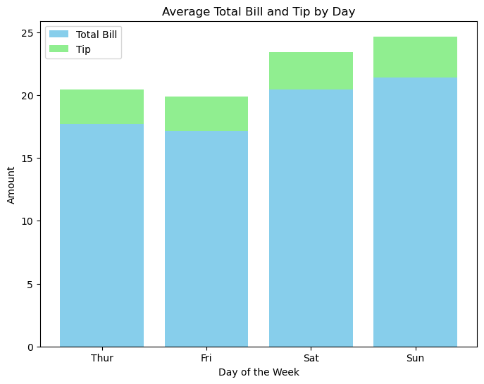
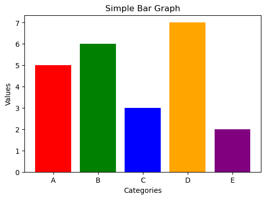
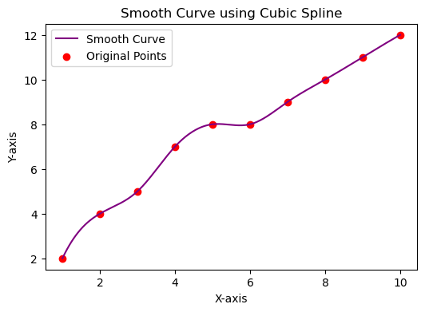
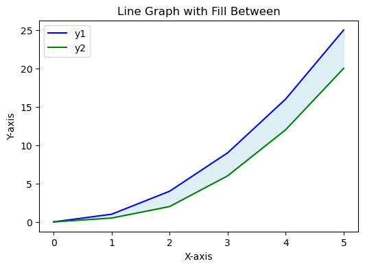
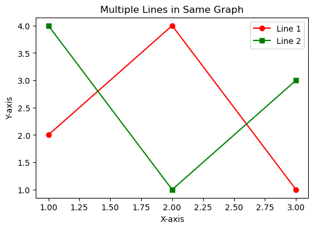
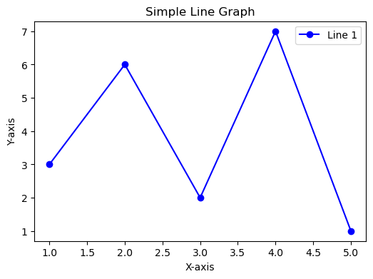

# EXNO-5-DS-DATA VISUALIZATION USING MATPLOT LIBRARY

# Aim:
  To Perform Data Visualization using matplot python library for the given datas.

# EXPLANATION:
Data visualization is the graphical representation of information and data. By using visual elements like charts, graphs, and maps, data visualization tools provide an accessible way to see and understand trends, outliers, and patterns in data.

# Algorithm:
STEP 1:Include the necessary Library.

STEP 2:Read the given Data.

STEP 3:Apply data visualization techniques to identify the patterns of the data.

STEP 4:Apply the various data visualization tools wherever necessary.

STEP 5:Include Necessary parameters in each functions.

# Coding and Output:

```
# -*- coding: utf-8 -*-
"""
EXNO:05 Data Visualization Using Matplotlib

# STEP 1: Import libraries
import pandas as pd
import numpy as np
import matplotlib.pyplot as plt
import seaborn as sns
from scipy.interpolate import make_interp_spline

# ----------------------------
# STEP 2: Prepare the data
# ----------------------------

# Sample data for line, bar, scatter, pie charts
x_line = [1, 2, 3, 4, 5]
y_line = [3, 6, 2, 7, 1]

x1_line = [1,2,3]
y1_line = [2,4,1]
x2_line = [1,2,3]
y2_line = [4,1,3]

x_fill = [0,1,2,3,4,5]
y1_fill = [0,1,4,9,16,25]
y2_fill = [0,0.5,2,6,12,20]

x_spline = np.array([1, 2, 3, 4, 5, 6, 7, 8, 9, 10])
y_spline = np.array([2, 4, 5, 7, 8, 8, 9, 10, 11, 12])

bar_values = [5, 6, 3, 7, 2]
bar_names = ["A", "B", "C", "D", "E"]

scatter_x = [1,2,3,4,5,6,7,8,9,10]
scatter_y = [2,4,5,7,6,8,9,11,12,12]

pie_labels = ['eat', 'sleep', 'work', 'play']
pie_slices = [3, 7, 8, 6]
pie_colors = ['r', 'y', 'g', 'b']

# STEP 3: Data Visualization
# ----------------------------

# 1. Simple Line Graph
plt.figure(figsize=(6,4))
plt.plot(x_line, y_line, label='Line 1', color='blue', marker='o')
plt.xlabel('X-axis')
plt.ylabel('Y-axis')
plt.title('Simple Line Graph')
plt.legend()
plt.show()

# 2. Multiple Lines on Same Graph
plt.figure(figsize=(6,4))
plt.plot(x1_line, y1_line, label='Line 1', color='red', marker='o')
plt.plot(x2_line, y2_line, label='Line 2', color='green', marker='s')
plt.xlabel('X-axis')
plt.ylabel('Y-axis')
plt.title('Multiple Lines in Same Graph')
plt.legend()
plt.show()

# 3. Line Graph with Fill Between
plt.figure(figsize=(6,4))
plt.plot(x_fill, y1_fill, label='y1', color='blue')
plt.plot(x_fill, y2_fill, label='y2', color='green')
plt.fill_between(x_fill, y1_fill, y2_fill, color='lightblue', alpha=0.4)
plt.xlabel('X-axis')
plt.ylabel('Y-axis')
plt.title('Line Graph with Fill Between')
plt.legend()
plt.show()

# 4. Smooth Curve using Cubic Spline
x_smooth = np.linspace(x_spline.min(), x_spline.max(), 300)
spl = make_interp_spline(x_spline, y_spline, k=3)
y_smooth = spl(x_smooth)

plt.figure(figsize=(6,4))
plt.plot(x_smooth, y_smooth, color='purple', label='Smooth Curve')
plt.scatter(x_spline, y_spline, color='red', label='Original Points')
plt.xlabel('X-axis')
plt.ylabel('Y-axis')
plt.title('Smooth Curve using Cubic Spline')
plt.legend()
plt.show()

# 5. Simple Bar Graph
plt.figure(figsize=(6,4))
plt.bar(bar_names, bar_values, color=['red','green','blue','orange','purple'])
plt.xlabel('Categories')
plt.ylabel('Values')
plt.title('Simple Bar Graph')
plt.show()

# 6. Stacked Bar Graph using Tips Dataset (fixed for FutureWarning)
df = sns.load_dataset("tips")
avg_total_bill = df.groupby('day', observed=False)['total_bill'].mean()
avg_tip = df.groupby('day', observed=False)['tip'].mean()

plt.figure(figsize=(8,6))
plt.bar(avg_total_bill.index, avg_total_bill, label='Total Bill', color='skyblue')
plt.bar(avg_tip.index, avg_tip, bottom=avg_total_bill, label='Tip', color='lightgreen')
plt.xlabel('Day of the Week')
plt.ylabel('Amount')
plt.title('Average Total Bill and Tip by Day')
plt.legend()
plt.show()

# 7. Scatter Plot
plt.figure(figsize=(6,4))
plt.scatter(scatter_x, scatter_y, label="Stars", color="green", marker="*", s=100)
plt.xlabel('X-axis')
plt.ylabel('Y-axis')
plt.title('Scatter Plot Example')
plt.legend()
plt.show()

# 8. Pie Chart
plt.figure(figsize=(6,6))
plt.pie(pie_slices, labels=pie_labels, colors=pie_colors, autopct='%1.1f%%', startangle=90)
plt.title('Daily Activities Pie Chart')
plt.show()


```
# OUTPUT



 
 
 
 


# Result:
  "The Experiment to Perform Data Visualization using matplot python library for the given datas has been done successfully and the output is verified."

